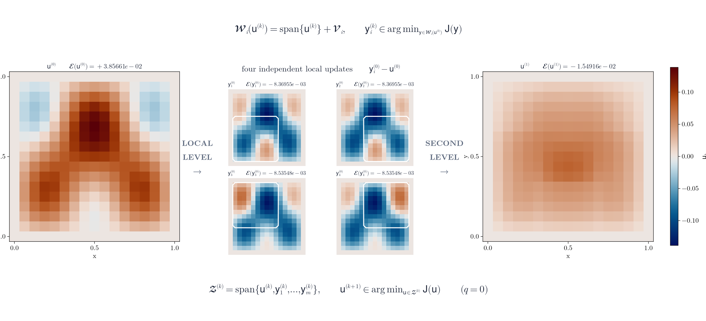
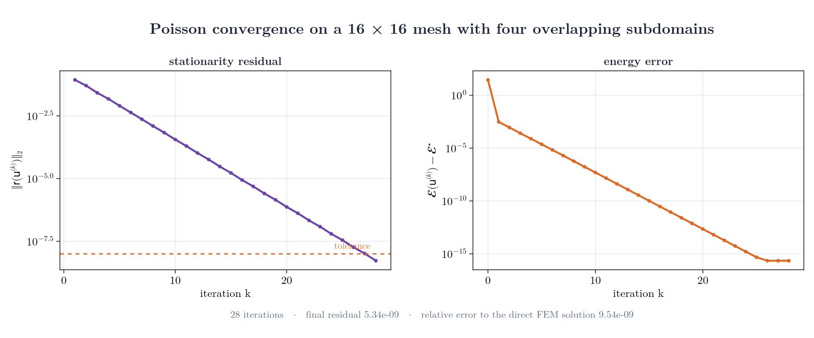

# EnergyMinimizingDD.jl

<p align="center">
  <strong>Energy-minimizing domain decomposition for finite-element problems in Julia</strong>
</p>

<p align="center">
  <a href="https://github.com/lamBOOO/EnergyMinimizingDD.jl/actions/workflows/ci.yml"></a>
  <a href="https://julialang.org/"></a>
  <a href="docs/src/index.md"></a>
  <a href="#project-status"></a>
</p>

<p align="center">
  
</p>

EnergyMinimizingDD.jl implements energy-minimizing domain-decomposition methods for finite-element problems. Each iteration solves independent variational problems on overlapping local spaces and then recombines the resulting candidates through a small global minimization. A common solver interface supports quadratic source problems, generalized eigenproblems, semilinear energies, and Gross–Pitaevskii models.

The figure visualizes one computed iteration of the Poisson example below, starting from an asymmetric initial field. The middle panels show the local corrections $\mathsf y_i^{(0)}-\mathsf u^{(0)}$; the white contours identify the degrees of freedom in each overlapping subspace. The displayed energy values are evaluated from the actual iterates. The figure can be reproduced with [`docs/generate_readme_figures.jl`](docs/generate_readme_figures.jl).

## Scope

The package currently provides:

- objective functions for quadratic source problems, generalized Rayleigh quotients, semilinear equations, and Gross–Pitaevskii models;
- finite-element assembly based on [Gridap.jl](https://github.com/gridap/Gridap.jl);
- overlapping METIS and Cartesian partitions of the finite-element degrees of freedom;
- additive and multiplicative local sweeps, variational second-level recombination, and optional enrichment with previous iterates; and
- convergence histories, local-solver diagnostics, reproducible benchmark studies, and example notebooks.

## Quick start: Poisson's equation

Install the current development version directly from GitHub:

```julia
import Pkg
Pkg.add(url="https://github.com/lamBOOO/EnergyMinimizingDD.jl.git")
```

The following example solves

$$
-\Delta u = 1 \quad \text{in } (0,1)^2,
\qquad u = 0 \quad \text{on } \partial(0,1)^2,
$$

with four overlapping subdomains:

```julia
using EnergyMinimizingDD, LinearAlgebra

const FEM = EnergyMinimizingDD.FEMDiscretizations
const E = EnergyMinimizingDD.Energies
const S = EnergyMinimizingDD.Solvers

A, _, b, subdomains, _ = FEM.FEM_Schroedinger(
    16, 4; P=x -> 0.0, f=x -> 1.0, overlap=2,
    partitioning=:cartesian,
)
energy = E.QuadraticEnergy(A, b)
u, _, _, _, residuals = S.var_dd(
    energy, subdomains; maxiter=50, tol=1e-8, verbose=false,
)

@show length(residuals) norm(A * u - b)
# length(residuals) = 28
# norm(A * u - b) = 5.337471100984455e-9
```

<p align="center">
  
</p>

The Cartesian partition makes this small example deterministic. For irregular meshes and larger computations, use the default `partitioning=:metis`.

## Two-level energy-minimizing method

Following the notation of the accompanying theory manuscript, consider an overlapping decomposition $\mathcal V=\sum_{i=1}^m\mathcal V_i$ and an objective $\mathsf J:\mathcal V\to\mathbb R\cup\{+\infty\}$. Given the current iterate $\mathsf u^{(k)}$, the method enriches every local space with the global iterate and solves the resulting local minimization problems independently:

$$
\begin{aligned}
\mathcal W_i\!\left(\mathsf u^{(k)}\right)
  &= \operatorname{span}\!\left\{\mathsf u^{(k)}\right\}+\mathcal V_i, \\
\mathsf y_i^{(k)}
  &\in \underset{\mathsf y\in\mathcal W_i(\mathsf u^{(k)})}{\operatorname{arg\,min}}
     \,\mathsf J(\mathsf y),
  && i=1,\ldots,m.
\end{aligned}
$$

The local candidates are combined variationally rather than through a prescribed weighted sum. For a history depth $q\geq0$, let $\widetilde q_k=\min\{q,k\}$. The method forms a compact second-level space from the candidates and the available iterate history, then minimizes the same objective over that space:

$$
\begin{aligned}
\mathcal Z^{(k)}
  &= \operatorname{span}\!\left\{
     \mathsf u^{(k-\widetilde q_k)},\ldots,\mathsf u^{(k)},
     \mathsf y_1^{(k)},\ldots,\mathsf y_m^{(k)}\right\}, \\
\mathsf u^{(k+1)}
  &\in \underset{\mathsf u\in\mathcal Z^{(k)}}{\operatorname{arg\,min}}
     \,\mathsf J(\mathsf u).
\end{aligned}
$$

With the default `history_depth=0`, the second level uses the current iterate and the new local candidates. A positive history depth retains up to $q$ earlier iterates and can improve the global recombination without changing the local problems.

### Model objectives

For a symmetric positive-definite linear source problem, the objective is the discrete energy

$$
\mathcal E(\mathsf v)
  = \tfrac12\mathsf v^\top\mathsf A\mathsf v
  - \mathsf b^\top\mathsf v,
\qquad \mathsf A\succ0.
$$

Its unique minimizer is denoted by $\mathsf u^\star$. Convergence can be measured with the stationarity residual

$$
\mathsf r(\mathsf u)
  := \nabla\mathcal E(\mathsf u)
  = \mathsf A\mathsf u-\mathsf b.
$$

For the generalized eigenproblem

$$
\mathsf A\mathsf u^*=\lambda^*\mathsf M\mathsf u^*,
$$

the objective is the generalized Rayleigh quotient

$$
\mathsf J(\mathsf v)
  = \frac{\mathsf v^\top\mathsf A\mathsf v}
         {\mathsf v^\top\mathsf M\mathsf v}.
$$

The two-level construction is unchanged: both the local and global subproblems minimize the relevant objective. In the eigenvalue setting, these minimizations are Rayleigh–Ritz problems on the corresponding trial spaces.

## Supported problem classes

| Problem class | Energy type | Example |
|---|---|---|
| Linear source / Poisson | `QuadraticEnergy` | [`study4_poisson.jl`](examples/paper/study4_poisson.jl) |
| Generalized eigenproblem | `GeneralizedRayleighQuotient` | [`study89_note.md`](examples/paper/study89_note.md) |
| Generic semilinear Poisson | `NonlinearEnergy` | [`study11_note.md`](examples/paper/study11_note.md) |
| Gross–Pitaevskii ground state | `GrossPitaevskiiRayleighQuotient` | [`study10_note.md`](examples/paper/study10_note.md) |
| Backward-Euler gradient flow | repeated `QuadraticEnergy` solves | [`heat_equation_dd.jl`](examples/heat_equation_dd.jl) |

## Documentation and examples

- [Getting started and package overview](docs/src/index.md)
- [API reference](docs/src/api.md)
- [Example programs and notebooks](examples)
- [Benchmark methodology and fairness conventions](examples/paper/study89_note.md)
- [Reusable benchmark references](examples/paper/references.bib)

To reproduce the repository environment and run the test suite:

```bash
git clone https://github.com/lamBOOO/EnergyMinimizingDD.jl.git
cd EnergyMinimizingDD.jl
julia --project=. -e 'using Pkg; Pkg.instantiate(); Pkg.test()'
```

## Project status

EnergyMinimizingDD.jl is experimental research software. The implementation is covered by automated tests, but the public API may evolve before a stable release. Questions, bug reports, benchmark contributions, and focused pull requests are welcome through [GitHub Issues](https://github.com/lamBOOO/EnergyMinimizingDD.jl/issues).
